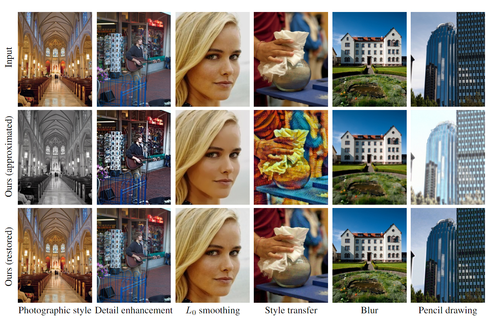

# Restorable Image Operators with Quasi-Invertible Networks
This is the PyTorch implementation of paper:  [Restorable Image Operators with Quasi-Invertible Networks (AAAI 2022).](https://aaai.org/papers/02008-restorable-image-operators-with-quasi-invertible-networks/).


## Brief Introduction
We propose a quasi-invertible model that learns common image processing operators in a restorable fashion: the learned image operators can generate visually pleasing results with the original content embedded.



## Dependencies  
- Python 3 
- [PyTorch >= 1.0](https://pytorch.org/)
- NVIDIA GPU + [CUDA](https://developer.nvidia.com/cuda-downloads)
- Python packages: `pip install numpy opencv-python lmdb pyyaml`
  
## Dataset Preparation
We use [Adobe5K](https://data.csail.mit.edu/graphics/fivek/) dataset for training and evaluation. 


## Get Started
Training and testing codes are in ['codes/'](./codes/). Refer to the training scripts for the detailed options.

## Acknowledgement
The code is based on [invertible image rescaling](https://github.com/pkuxmq/Invertible-Image-Rescaling). Thanks the authors for sharing their code. 

## Contact
If you have any questions, please contact <ououkenneth@gmail.com>.

## Citation 
If you find the code useful please cite:
```
@inproceedings{ouyang2022restorable,
  title={Restorable Image Operators with Quasi-Invertible Networks},
  author={Ouyang, Hao and Wang, Tengfei and Chen, Qifeng},
  booktitle={Proceedings of the AAAI Conference on Artificial Intelligence},
  volume={36},
  number={2},
  pages={2008--2016},
  year={2022}
}
```